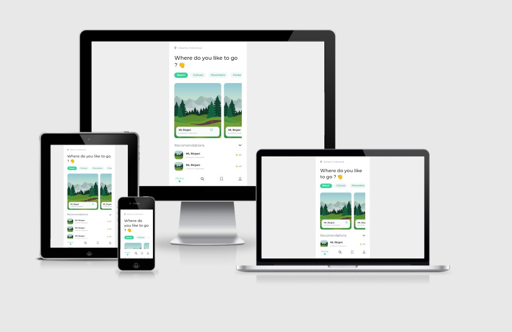

<h3 align="center">Travel App</h3>

Slicing project #05

### About
This is my projects to make UI using front end tech 

Where the ideas and the concept i use from any other designer UI/UX from Instagram or Dribbble

### Original design
by [@cirrustudio](https://instagram.com/cirrustudio?utm_medium=copy_link)

### Languages and Tools
- Vue Js 3
- Tailwindcss
- Google Font Montserrat
- FontAwesome
- Termux
- Vite Js
- Acode code editor

### Responsive Test
Test via [Am I Responsive](http://ami.responsivedesign.is/)

### Clone This Repo
- <code>git clone https://github.com/or-abdillh/travel-app-3.git </code>
- <code>cd travel-app-3</code>
- <code>npm install</code>
- <code>npm run dev</code>

### Demo 
- [Travel App](https://travel-app-3.vercel.app/)
- [Reels Instagram](https://www.instagram.com/reel/CXFyzdwlr0T/?utm_medium=copy_link)

[Oka R Abdillah ](http://github.com/or-abdillh)
 
Last edited on : 5/12/2021